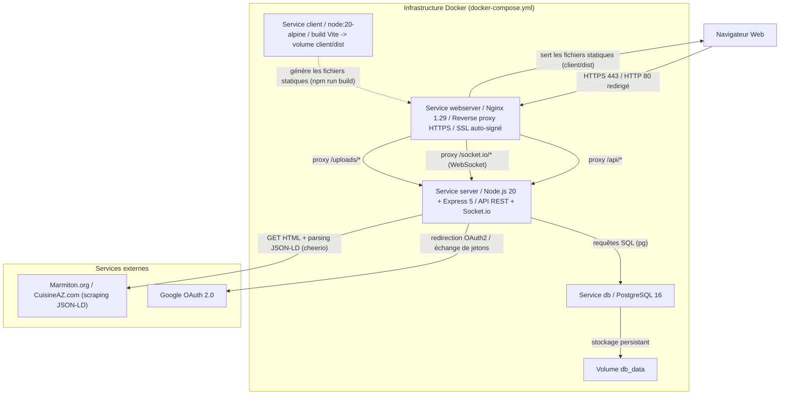

## Table des matières

1. [Introduction](#1-introduction)
    - 1.1 [Objectifs](#11-objectifs)
    - 1.2 [Stack technique](#12-stack-technique)
    - 1.3 [Prérequis](#13-prérequis)
2. [Architecture générale](#2-architecture-générale)
3. [Environnement technique](#3-environnement-technique)
    - 3.1 [Backend](#31-backend)
    - 3.2 [Frontend](#32-frontend)
    - 3.3 [Base de données](#33-base-de-données)
    - 3.4 [Prérequis logiciels](#34-prérequis-logiciels)
    - 3.5 [Fichiers de configuration clés](#35-fichiers-de-configuration-clés)
    - 3.6 [Variables d'environnement (`server/.env`)](#36-variables-denvironnement-serverenv)
    - 3.7 [Certificats SSL](#37-certificats-ssl)
4. [Structure du projet](#4-structure-du-projet)
    - 4.1 [Explication des architectures](#41-explication-des-architectures)
    - 4.2 [Convention de nommage et bonnes pratiques](#42-convention-de-nommage-et-bonnes-pratiques)
5. [Guide de déploiement de l'application](#5-guide-de-déploiement-de-lapplication)
6. [Justification du choix des langages et des librairies](#6-justification-du-choix-des-langages-et-des-librairies)
7. [Description de la base de données](#7-description-de-la-base-de-données)
8. [Description de l'API (Endpoints)](#8-description-de-lapi-endpoints)
9. [Configuration et sécurité](#9-configuration-et-sécurité)
10. [Diagrammes de séquence UML](#10-diagrammes-de-séquence-uml)
11. [Conclusion](#11-conclusion)

---

## 1. Introduction

Cette documentation technique a été rédigée à l'intention des professionnels amenés à travailler sur le projet SUPMEAL, une application web de gestion de recettes de cuisine conçue pour permettre à des utilisateurs de créer, organiser, partager et planifier leurs recettes au sein de « cookbooks » collaboratifs. Cette documentation a pour objectif de fournir une vision claire de l'architecture technique de l'application, de ses dépendances, ainsi que de son fonctionnement interne.

Elle constitue une référence pour toute personne souhaitant comprendre en profondeur le fonctionnement de SUPMEAL, en particulier en ce qui concerne les choix technologiques effectués, les mécanismes de déploiement, l'organisation du code source, ainsi que les données manipulées par le système. Les éléments techniques exposés ici couvrent l'ensemble de l'environnement nécessaire à la mise en œuvre de l'application, depuis la configuration jusqu'à la mise en production de la solution.

Un soin particulier a été apporté à la justification des langages, frameworks et bibliothèques utilisées, en s'appuyant sur des critères de performance, de maintenabilité, de compatibilité et d'évolutivité. Des diagrammes UML et un schéma de base de données viennent illustrer la structure logique et les interactions entre les différents composants du système, offrant ainsi une meilleure compréhension du modèle de données et de l'architecture logicielle.

À noter que cette documentation technique se distingue du manuel utilisateur, lequel s'adresse aux usagers de l'application et a pour vocation de détailler l'utilisation des fonctionnalités proposées. Ici, l'approche est résolument technique : elle vise à permettre aux professionnels du développement logiciel de déployer, maintenir et faire évoluer efficacement SUPMEAL, dans le respect des standards de qualité et de sécurité.

### 1.1 Objectifs

Le projet est conçu pour être une application web moderne, sécurisée et collaborative, en s'appuyant sur une architecture de services conteneurisés avec Docker. Les objectifs principaux sont :
-   Fournir une API RESTful complète pour la gestion des recettes, des cookbooks et des utilisateurs.
-   Offrir une interface utilisateur agréable et intuitive, compilée statiquement pour des performances optimales.
-   Permettre la collaboration en temps réel entre les membres d'un même cookbook via une messagerie instantanée.
-   Faciliter l'import de recettes existantes depuis des sites tiers reconnus (Marmiton, CuisineAZ) ainsi que l'export/import des données personnelles de l'utilisateur.
-   Assurer la persistance des données via une base de données relationnelle robuste.
-   Garantir un déploiement simple et reproductible grâce à la conteneurisation.

### 1.2 Stack technique

-   **Backend :** Node.js 20 avec Express.js 5
-   **Frontend :** React 19 compilé avec Vite (servi statiquement)
-   **Base de données :** PostgreSQL 16 (extensions `pgcrypto` et `pg_trgm`)
-   **Temps réel :** Socket.io (messagerie instantanée par cookbook)
-   **Reverse Proxy :** Nginx (HTTPS, certificat auto-signé)
-   **Conteneurisation :** Docker et Docker Compose

### 1.3 Prérequis

Cette section liste les prérequis logiciels et matériels ainsi que les étapes minimales à suivre après avoir récupéré le projet pour pouvoir démarrer l'application avec Docker Compose en suivant cette documentation.

-   Dépôt du projet : [https://github.com/Adrenalynee/4RESIT](https://github.com/Adrenalynee/4RESIT)

-   Prérequis logiciels (versions minimales recommandées) :
    -   **Docker Desktop** (inclut Docker Engine et Docker Compose v2) — c'est le seul prérequis réellement obligatoire, l'intégralité du build (backend, frontend, base de données) étant orchestrée par Docker Compose.
    -   Git : pour cloner le dépôt du projet ci-dessus.
    -   OpenSSL : uniquement nécessaire si les certificats auto-signés fournis dans `nginx/` doivent être régénérés (voir section 3.7).

-   Ports attendus par défaut (`docker-compose.yml`) :
    -   80 (HTTP, redirigé vers HTTPS) et 443 (HTTPS) — exposés par le service `webserver` (Nginx), point d'entrée public unique.
    -   5000 — API Node.js/Express, exposée pour le débogage direct mais destinée à être appelée via le reverse proxy.
    -   5432 — PostgreSQL, exposé pour un accès direct depuis l'hôte (ex. client SQL de développement).

-   Fichiers et variables indispensables :
    -   Créer un fichier `server/.env` (non versionné, voir section 3.6) contenant au minimum `DATABASE_URL`, `PORT`, `JWT_SECRET`, `GOOGLE_CLIENT_ID`, `GOOGLE_CLIENT_SECRET` et `GOOGLE_CALLBACK_URL`.
    -   Des certificats auto-signés (`nginx/private.key`, `nginx/certificate.crt`) doivent être présents dans le dossier `nginx/` pour que Nginx puisse servir l'application en HTTPS (voir section 3.7).

---

## 2. Architecture générale

L'application SUPMEAL repose sur une architecture multi-services conteneurisée, orchestrée par Docker Compose. Chaque partie de l'application est isolée dans son propre service pour une meilleure modularité et une maintenance simplifiée : un reverse proxy Nginx en frontal, un service qui construit le frontend React/Vite en fichiers statiques, une API Node.js/Express qui porte toute la logique métier et le canal temps réel Socket.io, et une base de données PostgreSQL. Le backend communique également avec des services externes : l'API OAuth 2.0 de Google pour l'authentification, et les sites Marmiton et CuisineAZ pour l'import de recettes par scraping.



### 2.1 Description des services Docker (`docker-compose.yml`)

1.  **Service `db`**
    -   **Image :** `postgres:16`
    -   **Rôle :** Fait tourner la base de données PostgreSQL.
    -   **Configuration :** Base `supmeal`, utilisateur `supmeal_user`, mot de passe défini par variables d'environnement dans `docker-compose.yml`.
    -   **Persistance :** Utilise un volume Docker nommé `db_data` pour garantir que les données ne sont pas perdues lors du redémarrage du conteneur.
    -   **Initialisation :** Monte `./db/init` en lecture seule sur `/docker-entrypoint-initdb.d`, ce qui déclenche l'exécution automatique des scripts SQL au premier démarrage (voir section 5).
    -   **Port :** Expose le port `5432`.

2.  **Service `server`**
    -   **Image :** Construite depuis le `Dockerfile` situé dans `./server` (image de base `node:20`).
    -   **Rôle :** Exécute l'API backend en Node.js/Express, gère l'authentification, la logique métier (recettes, cookbooks, planning...) et héberge le serveur Socket.io pour la messagerie instantanée.
    -   **Configuration :** La chaîne de connexion à la base est fournie via `DATABASE_URL`, en cohérence avec les identifiants du service `db`.
    -   **Volume :** Monte `./server:/app`, un montage de type bind mount qui permet de refléter les modifications du code source sans reconstruire l'image (pratique en développement, voir la remarque de la section 5).
    -   **Dépendance :** Dépend du service `db`.
    -   **Port :** Expose le port `5000`, consommé en interne par Nginx.

3.  **Service `client`**
    -   **Image :** `node:20-alpine` (utilisée directement, sans `Dockerfile` dédié).
    -   **Rôle :** Ce service n'est pas un serveur applicatif persistant : sa commande (`rm -rf node_modules package-lock.json && npm i --include=optional && npm run build`) installe les dépendances du frontend puis exécute le build Vite, qui écrit le résultat dans `client/dist`. Le conteneur se termine une fois le build achevé.
    -   **Volume :** Monte `./client:/app`, de sorte que le dossier `dist` produit soit directement disponible sur l'hôte et donc accessible au service `webserver`.
    -   **Dépendance :** Dépend du service `server` (ordre de démarrage uniquement).

4.  **Service `webserver`**
    -   **Image :** `nginx:1.29.0-alpine`
    -   **Rôle :** Agit comme reverse proxy et serveur web pour les fichiers statiques. C'est le seul point d'entrée public de l'application.
    -   **Fonctions :**
        -   Sert les fichiers compilés du frontend React depuis `./client/dist` (monté sur `/var/supmeal`).
        -   Redirige les requêtes `/api/`, `/socket.io/` et `/uploads/` vers le service `server`.
        -   Gère la terminaison SSL/TLS avec les certificats montés depuis `nginx/private.key` et `nginx/certificate.crt`.
        -   Redirige tout le trafic HTTP (port 80) vers HTTPS (port 443).
    -   **Dépendance :** Dépend des services `server` et `client`.

---

## 3. Environnement technique

### 3.1 Backend

SUPMEAL utilise Node.js 20 comme environnement d'exécution backend, un choix technique justifié par ses performances dans le traitement des opérations d'entrées/sorties (accès base de données, upload d'images, appels HTTP sortants vers Google et vers les sites de recettes). Express 5 structure l'API REST avec son architecture de middlewares modulaires (authentification, contrôle des rôles, limitation de débit), organisée par domaine fonctionnel dans le dossier `server/routes/`.

### 3.2 Frontend

Le frontend s'appuie sur React 19 compilé avec Vite, offrant une expérience de développement moderne (Hot Module Replacement quasi instantané) et des performances de build optimisées. Tailwind CSS (via le plugin `@tailwindcss/vite`) apporte une approche utility-first pour un design system cohérent et maintenable, et `react-router-dom` gère la navigation côté client (pages protégées via un composant `ProtectedRoute`).

### 3.3 Base de données

PostgreSQL 16 assure la persistance des données avec ses garanties ACID et ses capacités relationnelles avancées, parfaitement adaptées aux relations complexes entre utilisateurs, cookbooks, recettes, ingrédients, tags et commentaires. Deux extensions sont activées au démarrage (`db/init/001_schema.sql`) : `pgcrypto`, qui fournit `gen_random_uuid()` pour générer les identifiants UUID de toutes les tables, et `pg_trgm`, qui alimente des index GIN de recherche approximative (trigrammes) sur les noms d'ingrédients, de tags, les titres de recettes et le texte des étapes.

### 3.4 Prérequis logiciels

-   **Docker Desktop :** seul prérequis obligatoire pour démarrer l'application ; embarque Docker Engine et Docker Compose v2.
-   **Git :** pour cloner le dépôt du projet ([https://github.com/Adrenalynee/4RESIT](https://github.com/Adrenalynee/4RESIT)).
-   **OpenSSL :** uniquement pour régénérer des certificats auto-signés si ceux fournis dans `nginx/` sont absents ou expirés.

### 3.5 Fichiers de configuration clés

-   `docker-compose.yml` : orchestre le déploiement des quatre services (`db`, `server`, `client`, `webserver`).
-   `server/.env` : fichier **critique**, non versionné, contenant les secrets et la configuration du backend (voir section 3.6).
-   `nginx/conf/default.conf` : configuration principale du reverse proxy (terminaison SSL, routes `/api/`, `/socket.io/`, `/uploads/`, fallback React Router).
-   `nginx/conf/ssl_redirect.conf` : redirection permanente du port 80 (HTTP) vers le port 443 (HTTPS).
-   `db/init/001_schema.sql` : définition complète du schéma relationnel (tables, contraintes, index).
-   `db/init/002_triggers.sql` : triggers PL/pgSQL de mise à jour automatique des colonnes `updated_at`.

### 3.6 Variables d'environnement (`server/.env`)

Le fichier `server/.env` doit être créé à la racine du dossier `server` avant de lancer l'application. Il est volontairement absent du dépôt (`.gitignore` exclut `server/.env`) car il contient des secrets. Voici le modèle à utiliser :

```env
# Doit correspondre aux identifiants définis pour le service `db` dans docker-compose.yml
DATABASE_URL=postgres://supmeal_user:supmeal_pass@db:5432/supmeal

# Port d'écoute du serveur Node.js
PORT=5000

# Secret de signature des tokens JWT — à remplacer par une valeur longue et aléatoire
JWT_SECRET=<mettre_un_secret_jwt_robuste>

# Identifiants OAuth 2.0 Google (voir procédure ci-dessous)
GOOGLE_CLIENT_ID=<votre_client_id_google.apps.googleusercontent.com>
GOOGLE_CLIENT_SECRET=<votre_secret_client_google>
GOOGLE_CALLBACK_URL=https://localhost/api/auth/google/callback
```

Si `GOOGLE_CLIENT_ID` et `GOOGLE_CLIENT_SECRET` sont absents, le module `server/config/passport.js` n'enregistre simplement pas la stratégie Google (condition `if (process.env.GOOGLE_CLIENT_ID && process.env.GOOGLE_CLIENT_SECRET)`) : l'authentification classique par email/mot de passe reste alors pleinement fonctionnelle, seule la connexion « Se connecter avec Google » est désactivée.

#### 3.6.1 Configuration Google OAuth 2.0

Pour obtenir de véritables identifiants `GOOGLE_CLIENT_ID` et `GOOGLE_CLIENT_SECRET`, la procédure à suivre pour quiconque souhaiterait déployer réellement SUPMEAL avec l'authentification Google active est la suivante :

**1. Accéder à Google Cloud Console**
- Se rendre sur [Google Cloud Console](https://console.cloud.google.com/)
- Se connecter avec un compte Google

**2. Créer un nouveau projet**
- Cliquer sur le sélecteur de projet en haut de la page
- Cliquer sur « Nouveau projet », lui donner un nom (ex. `supmeal`)
- Cliquer sur « Créer »

**3. Configurer l'écran de consentement OAuth**
- Dans le menu latéral, aller dans « APIs et services » > « Écran de consentement OAuth »
- Choisir le type d'utilisateur (« Externe » pour un test public) et renseigner les informations minimales requises (nom de l'application, email de support)

**4. Créer les identifiants OAuth**
- Aller dans « APIs et services » > « Identifiants »
- Cliquer sur « + Créer des identifiants » > « ID client OAuth »
- Sélectionner le type d'application « Application Web »

**5. Configurer les URLs autorisées**

En cohérence avec `GOOGLE_CALLBACK_URL` défini dans `server/.env` et la route `/api/auth/google/callback` exposée par `server/routes/auth.js` :

**Origines JavaScript autorisées :**
```
https://localhost
```

**URI de redirection autorisées :**
```
https://localhost/api/auth/google/callback
```

**6. Récupérer les clés**
- Cliquer sur « Créer »
- Copier l'**ID client** → `GOOGLE_CLIENT_ID`
- Copier le **Secret client** → `GOOGLE_CLIENT_SECRET`
- Reporter ces valeurs dans `server/.env`

### 3.7 Certificats SSL

Pour que Nginx puisse servir l'application en HTTPS, les fichiers suivants doivent être présents dans le dossier `nginx/` :
-   `private.key` : la clé privée SSL.
-   `certificate.crt` : le certificat SSL public.

Dans l'état actuel du projet, des certificats auto-signés sont **déjà générés et présents** dans `nginx/`. Ces fichiers sont volontairement exclus du contrôle de version (`.gitignore` liste `nginx/certificate.crt` et `nginx/private.key`) puisqu'il s'agit de matériel cryptographique propre à chaque environnement. Si le projet est récupéré sans ces fichiers (nouveau clone, nouvel environnement), ils peuvent être régénérés avec la commande suivante :

```bash
openssl req -x509 -nodes -days 365 -newkey rsa:2048 \
  -keyout nginx/private.key \
  -out nginx/certificate.crt \
  -subj "/C=FR/ST=Ile-de-France/L=Paris/O=Supmeal/CN=localhost"
```

Un certificat auto-signé suffit pour un usage en développement ou pour une soutenance ; en production, il est impératif d'utiliser des certificats valides émis par une autorité reconnue (par exemple via Let's Encrypt).

---

## 4. Structure du projet

### 4.1 Explication des architectures

L'architecture de SUPMEAL repose sur une séparation stricte entre trois responsabilités : interface utilisateur (React), logique métier (Node.js/Express) et persistance des données (PostgreSQL).

**Backend (`server/`)**
-   **`routes/`** : définit les endpoints de l'API REST par domaine fonctionnel (`auth.js`, `users.js`, `cookbooks.js`, `recipes.js`, `uploads.js`, `planning.js`, `data.js` pour l'import/export, et les référentiels `allergens.js`, `diets.js`, `cuisines.js`, `mealTypes.js`, `difficulty.js`). Chaque fichier applique les middlewares nécessaires directement au niveau du routeur.
-   **`middleware/`** : traitements transversaux — `auth.js` (vérification du JWT), `cookbookRole.js` (contrôle du rôle d'un utilisateur dans un cookbook) et `recipeAccess.js` (calcul des droits de lecture/écriture/commentaire sur une recette selon la propriété et l'appartenance à un cookbook).
-   **`config/`** : configuration des services externes, ici la stratégie Passport pour Google OAuth (`passport.js`).
-   **`utils/`** : fonctions métier réutilisables regroupées par domaine (`recipes.js`, `cookbooks.js`, `users.js`, `messages.js`, `planning.js`, `importExport.js`, `csv.js`, `uploads.js`, `password.js`, `recipeScraper.js`, `suggestions.js`, ainsi que les référentiels de valeurs `allergens.js`, `diets.js`, `cuisines.js`, `mealTypes.js`, `difficulty.js`).
-   **`sockets/`** : logique du canal temps réel — `chat.js` porte l'authentification des connexions Socket.io et les événements de messagerie par cookbook.
-   **`db.js`** : instancie le pool de connexions PostgreSQL (`pg`) à partir de `DATABASE_URL`.

**Frontend (`client/src/`)**
-   **`api/`** : couche d'abstraction pour les appels HTTP vers le backend, un fichier par ressource (`authApi.js`, `usersApi.js`, `cookbooksApi.js`, `recipesApi.js`, `uploadsApi.js`, `planningApi.js`, `dataApi.js`, `allergensApi.js`, `dietsApi.js`, `cuisinesApi.js`, `mealTypesApi.js`, `difficultyApi.js`), plus `http.js` (client HTTP centralisé) et `socket.js` (connexion Socket.io authentifiée).
-   **`components/`** : composants React réutilisables (cartes, carrousels, formulaires), avec un sous-dossier `modals/` pour l'ensemble des fenêtres modales de l'application (création/édition de recette, gestion de cookbook, confirmation de suppression...).
-   **`pages/`** : vues complètes correspondant aux routes déclarées dans `App.jsx` (`HomePage`, `LoginPage`, `RegisterPage`, `OAuthCallbackPage`, `RecipesPage`, `RecipeDetailPage`, `CookbooksPage`, `CookbookDetailPage`, `PlanningPage`, `SettingsPage`).
-   **`context/`** : contextes React pour l'état global (`AuthContext.jsx` pour la session utilisateur, `ThemeContext.jsx` pour le thème clair/sombre, `RecipeTaxonomyContext.jsx` pour les référentiels allergènes/régimes/cuisines).
-   **`utils/`** : fonctions utilitaires pures côté client (`date.js`, `url.js`, `permissions.js`, `passwordStrength.js`).
-   **`assets/`** : ressources statiques (icônes SVG, images de fond).

**Base de données (`db/init/`)**
-   Les scripts SQL sont numérotés (`001_schema.sql`, `002_triggers.sql`) afin de garantir un ordre d'exécution déterministe par PostgreSQL lors de l'initialisation du conteneur.

**Reverse proxy (`nginx/conf/`)**
-   Les fichiers de configuration Nginx sont séparés par responsabilité : `default.conf` pour le serveur HTTPS principal, `ssl_redirect.conf` pour la redirection HTTP → HTTPS.

### 4.2 Convention de nommage et bonnes pratiques

**Conventions de nommage :**
-   **Variables et fonctions (JS) :** camelCase (ex. `getMemberRole`, `scrapeRecipeFromUrl`, `requireCookbookRole`).
-   **Composants React :** PascalCase avec extension `.jsx` (ex. `RecipeCard.jsx`, `CookbookFlipPage.jsx`), tandis que les modules utilitaires et les modules d'API restent en camelCase (ex. `recipesApi.js`, `passwordStrength.js`).
-   **Routes API :** structure RESTful en kebab-case lorsque le mot est composé (ex. `/api/meal-types`, `/api/difficulty-levels`), sinon simplement le nom de la ressource au pluriel (`/api/recipes`, `/api/cookbooks`).
-   **Constantes :** UPPER_SNAKE_CASE (ex. `JWT_SECRET`, `ALLOWED_MIME_TO_EXT`, `MEAL_TYPE_VALUES`).
-   **Tables et colonnes SQL :** snake_case (ex. `recipe_planned_dates`, `owner_id`, `provider_user_id`), conforme aux conventions PostgreSQL usuelles.
-   **Dossiers :** minuscules, un dossier par responsabilité (`routes`, `middleware`, `utils`, `sockets`, `config`).

**Bonnes pratiques appliquées :**

-   **Structure modulaire :** séparation nette entre `client/` et `server/`, avec un découpage fonctionnel cohérent des deux côtés (routes/middlewares/utils côté serveur, pages/components/context/api côté client).
-   **Authentification centralisée :** toute la logique de vérification du token est mutualisée dans `middleware/auth.js` (`requireAuth`), réutilisée à l'identique par les routes REST et, de façon équivalente, par le canal Socket.io (`sockets/chat.js`).
-   **Contrôle d'accès dédié :** les règles de permission complexes (rôle dans un cookbook, propriétaire vs. membre d'une recette) sont isolées dans des middlewares spécifiques (`cookbookRole.js`, `recipeAccess.js`) plutôt que dispersées dans chaque route.
-   **Configuration externalisée :** les secrets et paramètres d'environnement ne sont jamais codés en dur ; ils sont lus via `process.env` (le script `npm start` du serveur utilise `node --env-file=.env index.js`).
-   **Conteneurisation (Docker-first) :** un unique `docker-compose.yml` à la racine définit l'ensemble des services, volumes et ports exposés, garantissant un environnement reproductible.
-   **Référentiels de valeurs centralisés :** les listes fermées (allergènes, régimes, cuisines, types de repas, niveaux de difficulté) sont chacune définies une seule fois côté serveur (`utils/*.js`) et exposées par une route dédiée, réutilisées à la fois pour la validation des entrées et pour l'affichage côté client.
-   **Linting :** `client/package.json` embarque `oxlint` (script `lint`) pour l'analyse statique du frontend.

---

## 5. Guide de déploiement de l'application

Le déploiement de SUPMEAL est entièrement géré par Docker Compose, ce qui le rend simple et reproductible.

### 5.1 Étapes de déploiement

1.  **Cloner le dépôt du projet**
    ```bash
    git clone https://github.com/Adrenalynee/4RESIT.git
    cd 4RESIT
    ```

2.  **Configurer l'environnement du backend**
    -   Créer un fichier `server/.env` en s'appuyant sur le modèle de la section 3.6.
    -   Renseigner un `JWT_SECRET` robuste ainsi que, si l'authentification Google doit être activée, `GOOGLE_CLIENT_ID`, `GOOGLE_CLIENT_SECRET` et `GOOGLE_CALLBACK_URL` (voir section 3.6.1).

    **Important :** le service `server` du `docker-compose.yml` monte `./server:/app` en volume, ce qui recouvre le contenu de l'image construite par le `Dockerfile` (y compris `node_modules` installé au build). Il est donc nécessaire d'installer les dépendances côté hôte avant de démarrer la stack, sous peine d'un conteneur `server` en échec au démarrage :
    ```bash
    cd server
    npm install
    cd ..
    ```

3.  **Vérifier la présence des certificats SSL**
    -   Des certificats auto-signés sont normalement déjà présents dans `nginx/` (`private.key`, `certificate.crt`).
    -   S'ils sont absents (nouvel environnement, fichiers gitignorés), les régénérer :
        ```bash
        openssl req -x509 -nodes -days 365 -newkey rsa:2048 \
          -keyout nginx/private.key \
          -out nginx/certificate.crt \
          -subj "/C=FR/ST=Ile-de-France/L=Paris/O=Supmeal/CN=localhost"
        ```

4.  **Lancer l'application avec Docker Compose**
    À la racine du projet :
    ```bash
    docker compose up -d --build
    ```
    -   `up` : crée et démarre les conteneurs.
    -   `-d` : mode détaché (les conteneurs tournent en arrière-plan).
    -   `--build` : force la reconstruction des images (utile après une modification du `Dockerfile` ou des dépendances).

    Cette unique commande déclenche automatiquement, sans étape manuelle supplémentaire :
    -   le build du frontend par le service `client` (installation des dépendances puis `npm run build`, résultat écrit dans `client/dist`) ;
    -   l'initialisation de la base de données au premier démarrage du service `db` : PostgreSQL exécute automatiquement, dans l'ordre alphabétique, tous les scripts placés dans `docker-entrypoint-initdb.d` (monté depuis `./db/init`), c'est-à-dire d'abord `001_schema.sql` (extensions, tables, contraintes, index) puis `002_triggers.sql` (triggers `updated_at`). Cette initialisation ne se répète pas sur les démarrages suivants tant que le volume `db_data` n'est pas supprimé.

### 5.2 Vérification du déploiement

-   **Voir les conteneurs actifs :**
    ```bash
    docker compose ps
    ```
    Les services `db`, `server` et `webserver` doivent afficher le statut `Up` ; le service `client` peut apparaître comme terminé (`Exited (0)`) une fois le build achevé, ce qui est le comportement normal.

-   **Accéder à l'application :**
    Ouvrir un navigateur sur `https://localhost`. Le certificat étant auto-signé, le navigateur affichera un avertissement de sécurité qu'il convient d'accepter en développement.

### 5.3 Commandes utiles

-   **Reconstruire uniquement le frontend après une modification du code React :**
    ```bash
    docker compose up -d --build client
    ```
-   **Consulter les logs de l'API :**
    ```bash
    docker compose logs -f server
    ```
-   **Arrêter l'application :**
    ```bash
    docker compose down
    ```
-   **Réinitialiser complètement la base de données (supprime les données) :**
    ```bash
    docker compose down -v
    ```

---

## 6. Justification du choix des langages et des librairies

Les choix technologiques effectués pour SUPMEAL s'appuient sur des critères de performance, de maintenabilité, de sécurité et d'adéquation avec le domaine métier — une application de gestion de recettes fortement relationnelle, où la collaboration en temps réel et l'import de contenu externe sont des exigences fonctionnelles de premier plan.

### 6.1 React et Vite

**React** a été retenu pour le frontend en raison de son approche composant-centrée, particulièrement adaptée à une application comme SUPMEAL où de nombreux éléments d'interface sont réutilisables et paramétrables : cartes de recette, carrousels, cookbooks feuilletables, modales de création/édition. La richesse de l'écosystème (routage avec `react-router-dom`, gestion d'état local via les contextes) permet de structurer une application à plusieurs pages protégées (recettes, cookbooks, planning, paramètres) sans dépendre d'un gestionnaire d'état externe complexe, la volumétrie des données manipulées côté client restant raisonnable.

**Vite** a remplacé les bundlers traditionnels type Webpack en s'appuyant sur les modules ES natifs pour offrir un serveur de développement quasi instantané et des temps de build réduits grâce à esbuild. Cette rapidité est directement exploitée par le pipeline de déploiement de SUPMEAL : le service `client` du `docker-compose.yml` exécute `npm run build` à chaque démarrage de la stack, et la vitesse de compilation de Vite rend cette approche « build à chaud » raisonnable sans allonger excessivement le temps de démarrage global de l'application.

### 6.2 Express

**Express 5** structure l'API REST du backend. Sa philosophie minimaliste et son système de middlewares empilables conviennent parfaitement à l'organisation retenue pour SUPMEAL : chaque domaine fonctionnel (authentification, utilisateurs, cookbooks, recettes, uploads, planning, import/export, référentiels) est isolé dans son propre routeur, et les préoccupations transversales — vérification du JWT, contrôle du rôle dans un cookbook, contrôle des droits sur une recette, limitation de débit — sont exprimées comme des middlewares composables plutôt que dupliquées dans chaque contrôleur. Cette architecture facilite la lecture du code (`router.use(requireAuth)` en tête de fichier suffit à protéger l'ensemble d'un routeur) et son évolution future.

### 6.3 PostgreSQL plutôt qu'une base NoSQL

Le choix d'une base de données **relationnelle** plutôt que d'une solution NoSQL (type MongoDB) découle directement de la structure des données manipulées par SUPMEAL. Le schéma applicatif (`db/init/001_schema.sql`) fait apparaître un réseau dense de relations à cardinalités variées et fortement contraintes : un utilisateur possède des préférences, des allergies, des régimes et des cuisines favorites ; il peut créer et rejoindre plusieurs cookbooks avec un rôle différent dans chacun (`cookbook_members`, table de jonction avec un type énuméré `cookbook_role`) ; une recette appartient à un propriétaire et, optionnellement, à un cookbook, référence un ensemble d'ingrédients et de tags via des tables de jonction (`recipe_ingredients`, `recipe_tags`), une liste ordonnée d'étapes (`recipe_steps`), des dates de planification (`recipe_planned_dates`) et des commentaires. Représenter ce graphe de relations many-to-many dans un document JSON imbriqué imposerait soit une duplication massive des données (un ingrédient dupliqué dans chaque recette qui l'utilise), soit une explosion du nombre de requêtes applicatives pour reconstituer les jointures qu'une base relationnelle exécute nativement et de façon optimisée.

PostgreSQL apporte de surcroît des garanties que le modèle NoSQL documentaire n'offre pas nativement : intégrité référentielle via les contraintes `FOREIGN KEY` (avec des politiques `ON DELETE CASCADE` ou `ON DELETE SET NULL` choisies au cas par cas selon la sémantique métier), unicité (`UNIQUE` sur `users.email`, `users.name`, `(provider, provider_user_id)` pour les comptes OAuth), validation de domaine via les contraintes `CHECK` (ex. `default_servings > 0`), et un type énuméré natif (`cookbook_role`) qui exclut par construction toute valeur de rôle invalide en base. Les index GIN combinés à l'extension `pg_trgm` permettent enfin une recherche approximative performante (titres de recettes, noms d'ingrédients et de tags, texte des étapes) sans dépendre d'un moteur de recherche externe, ce qui aurait représenté un service supplémentaire à opérer pour un gain fonctionnel marginal à l'échelle du projet.

### 6.4 JWT plutôt qu'une authentification par session

SUPMEAL retient une authentification **stateless** par JSON Web Token plutôt qu'une gestion de sessions côté serveur (cookie de session + stockage partagé). Ce choix répond à deux besoins concrets du projet. D'une part, l'API backend est interrogée à la fois par des requêtes HTTP classiques (`middleware/auth.js`, qui lit l'en-tête `Authorization: Bearer <token>`) et par des connexions Socket.io pour la messagerie temps réel (`sockets/chat.js`, qui vérifie le même token transmis dans `socket.handshake.auth.token`) : le JWT constitue un mécanisme d'authentification unique et symétrique pour ces deux canaux, sans avoir à synchroniser un magasin de sessions entre le serveur HTTP et le serveur WebSocket. D'autre part, un token JWT signé (`jsonwebtoken`, secret `JWT_SECRET`, expiration fixée à 7 jours) est auto-suffisant : il ne nécessite aucun état conservé côté serveur entre deux requêtes, ce qui simplifie l'architecture (aucun magasin de session à administrer) et rendrait triviale une évolution vers plusieurs instances du service `server` derrière Nginx, chaque instance pouvant valider n'importe quel token sans état partagé.

### 6.5 Socket.io pour la messagerie temps réel

La fonctionnalité de messagerie instantanée par cookbook impose un canal de communication bidirectionnel et à faible latence entre le serveur et les clients connectés, ce qu'une architecture purement REST (basée sur des requêtes ponctuelles) ne peut pas offrir nativement. **Socket.io** a été retenu pour porter cette fonctionnalité (`server/sockets/chat.js`, consommé côté client par `socket.io-client`) car il gère automatiquement la mise en salle des connexions par cookbook (`socket.join('cookbook:<id>')`), la diffusion ciblée des événements (`io.to(room).emit(...)`) et la reconnexion transparente en cas de coupure réseau, tout en retombant sur du long-polling HTTP si l'upgrade WebSocket échoue — un filet de sécurité précieux derrière un reverse proxy dont la configuration WebSocket (en-têtes `Upgrade`/`Connection`) doit être exacte, comme c'est le cas ici dans `nginx/conf/default.conf`. L'authentification du canal réutilise directement le même JWT que l'API REST, ce qui évite d'introduire un second mécanisme de sécurité dédié au temps réel.

### 6.6 Multer et liste blanche stricte de types MIME pour les uploads

Les uploads d'images (avatars, photos de recette) sont traités par **Multer**, la librairie de référence pour le traitement des formulaires `multipart/form-data` dans l'écosystème Express. Au-delà de la gestion du flux de fichiers, SUPMEAL applique une politique de sécurité volontairement restrictive dans `server/routes/uploads.js` : une table de correspondance `ALLOWED_MIME_TO_EXT` n'autorise que les types `image/png`, `image/jpeg`, `image/webp` et `image/gif`, et l'extension du fichier stocké sur disque est **dérivée de ce type MIME déclaré, jamais du nom de fichier envoyé par le client** — ce qui neutralise les tentatives de contournement par extension trompeuse. Le format **SVG est exclu par construction** de cette liste blanche : un fichier SVG peut embarquer du contenu `<script>` ou des gestionnaires d'événements exécutés par le navigateur si le fichier est ouvert ou affiché directement, ce qui en ferait un vecteur de faille XSS stockée si un utilisateur malveillant déposait un avatar ou une image de recette piégée. Le nom de fichier final est par ailleurs généré via `randomUUID()` plutôt que conservé depuis l'upload, ce qui élimine tout risque de traversée de chemin (`path traversal`) ou de collision de noms.

### 6.7 Cheerio plutôt qu'un navigateur headless pour l'import de recettes

La fonctionnalité d'import de recettes depuis une URL (`server/utils/recipeScraper.js`) doit récupérer le contenu structuré d'une page de recette hébergée sur Marmiton ou CuisineAZ. Le choix technique a porté sur **Cheerio**, une implémentation légère du DOM côté serveur, plutôt que sur un navigateur headless (Puppeteer ou Playwright). Ce choix est directement justifié par la nature des pages cibles : les deux sites exposent leurs métadonnées de recette au format **JSON-LD** (`schema.org/Recipe`) directement dans le HTML généré côté serveur, au sein d'une balise `<script type="application/ld+json">` — aucune exécution de JavaScript côté client n'est nécessaire pour accéder à ces données structurées (titre, temps de préparation/cuisson au format ISO 8601, portions, liste d'ingrédients, instructions). Un navigateur headless aurait ajouté un coût disproportionné — poids de l'image Docker (binaire Chromium), consommation mémoire et CPU par requête de scraping, temps de démarrage — pour un bénéfice nul puisque le rendu JavaScript des pages n'apporte ici aucune information supplémentaire par rapport au HTML brut. Cheerio, combiné à l'API `fetch` native de Node.js, permet de récupérer et parser ces pages avec une empreinte mémoire minimale, ce qui est cohérent avec le reste de l'architecture, volontairement légère.

### 6.8 Docker Compose plutôt que Kubernetes

L'orchestration de SUPMEAL repose sur **Docker Compose** plutôt que sur Kubernetes. Pour une application de la taille de SUPMEAL — quatre services, une seule instance de chacun, pas de besoin de montée en charge horizontale automatique ni de tolérance de panne multi-nœuds — Kubernetes introduirait une complexité opérationnelle largement disproportionnée par rapport aux besoins réels : gestion d'un cluster (control plane, etcd, kubelet), écriture et maintenance de manifests YAML par ressource (Deployment, Service, Ingress, PersistentVolumeClaim), configuration d'un ingress controller pour remplacer le rôle actuellement tenu par un simple fichier de configuration Nginx. Docker Compose, à l'inverse, permet de décrire l'intégralité de la topologie applicative — services, volumes, dépendances de démarrage, ports exposés — dans un unique fichier déclaratif, et de la faire tourner avec une seule commande (`docker compose up -d --build`), ce qui correspond exactement au contexte de déploiement de ce projet : un environnement de développement ou de soutenance unique, sans exigence de haute disponibilité distribuée.

---

## 7. Description de la base de données

La base de données est le cœur de SUPMEAL : elle centralise les comptes utilisateurs, leurs préférences alimentaires, les cookbooks collaboratifs, les recettes et l'ensemble de leurs métadonnées (ingrédients, étapes, tags, planification), ainsi que les commentaires et les messages de la messagerie instantanée. Le schéma, entièrement relationnel, est défini dans `db/init/001_schema.sql` et complété par les triggers de `db/init/002_triggers.sql`.

### 7.1 Schéma de la base de données (Mermaid)

```mermaid
erDiagram
    USERS ||--o{ OAUTH_ACCOUNTS : "relie"
    USERS ||--|| USER_PREFERENCES : "configure"
    USERS ||--o{ USER_ALLERGIES : "déclare"
    USERS ||--o{ USER_DIETS : "déclare"
    USERS ||--o{ USER_CUISINES : "déclare"
    USERS ||--o{ COOKBOOKS : "crée"
    USERS ||--o{ COOKBOOK_MEMBERS : "rejoint"
    USERS ||--o{ RECIPES : "possède"
    USERS ||--o{ COMMENTS : "écrit"
    USERS ||--o{ MESSAGES : "envoie"

    COOKBOOKS ||--o{ COOKBOOK_MEMBERS : "a pour membres"
    COOKBOOKS ||--o{ RECIPES : "contient"
    COOKBOOKS ||--o{ MESSAGES : "héberge"

    RECIPES ||--o{ RECIPE_INGREDIENTS : "requiert"
    RECIPES ||--o{ RECIPE_TAGS : "est taguée"
    RECIPES ||--o{ RECIPE_STEPS : "est décrite par"
    RECIPES ||--o{ RECIPE_PLANNED_DATES : "est planifiée"
    RECIPES ||--o{ COMMENTS : "reçoit"

    INGREDIENTS ||--o{ RECIPE_INGREDIENTS : "est utilisé dans"
    TAGS ||--o{ RECIPE_TAGS : "est appliqué à"

    USERS {
        UUID id PK
        TEXT name UK
        TEXT email UK
        TEXT password_hash "NULL si compte OAuth"
        TEXT avatar_url
        TIMESTAMPTZ created_at
        TIMESTAMPTZ updated_at
    }

    OAUTH_ACCOUNTS {
        UUID id PK
        UUID user_id FK "references USERS(id)"
        TEXT provider "CHECK IN (google, microsoft, github)"
        TEXT provider_user_id
        TIMESTAMPTZ created_at
    }

    USER_PREFERENCES {
        UUID user_id PK, FK "references USERS(id)"
        SMALLINT default_servings "CHECK > 0"
    }

    USER_ALLERGIES {
        UUID user_id PK, FK
        TEXT allergy PK
    }

    USER_DIETS {
        UUID user_id PK, FK
        TEXT diet PK
    }

    USER_CUISINES {
        UUID user_id PK, FK
        TEXT cuisine PK
    }

    COOKBOOKS {
        UUID id PK
        TEXT name
        TEXT description
        UUID created_by FK "references USERS(id), ON DELETE SET NULL"
        TIMESTAMPTZ created_at
        TIMESTAMPTZ updated_at
    }

    COOKBOOK_MEMBERS {
        UUID cookbook_id PK, FK
        UUID user_id PK, FK
        TEXT role "ENUM creator/editor/reader/commenter"
        TIMESTAMPTZ joined_at
    }

    INGREDIENTS {
        UUID id PK
        TEXT name UK
    }

    TAGS {
        UUID id PK
        TEXT name UK
    }

    RECIPES {
        UUID id PK
        TEXT title
        UUID owner_id FK "references USERS(id)"
        UUID cookbook_id FK "references COOKBOOKS(id), nullable"
        TEXT image_url
        SMALLINT prep_time_minutes
        SMALLINT cook_time_minutes
        SMALLINT servings
        TEXT source
        BOOLEAN favorite
        TEXT difficulty
        TIMESTAMPTZ created_at
        TIMESTAMPTZ updated_at
    }

    RECIPE_INGREDIENTS {
        UUID id PK
        UUID recipe_id FK "references RECIPES(id)"
        UUID ingredient_id FK "references INGREDIENTS(id)"
        TEXT quantity
        TEXT unit
        SMALLINT position
    }

    RECIPE_TAGS {
        UUID recipe_id PK, FK
        UUID tag_id PK, FK
    }

    RECIPE_STEPS {
        UUID id PK
        UUID recipe_id FK "references RECIPES(id)"
        SMALLINT position "UNIQUE avec recipe_id"
        TEXT instruction
    }

    RECIPE_PLANNED_DATES {
        UUID id PK
        UUID recipe_id FK "references RECIPES(id)"
        DATE planned_date "UNIQUE avec recipe_id"
    }

    COMMENTS {
        UUID id PK
        UUID recipe_id FK "references RECIPES(id)"
        UUID user_id FK "references USERS(id)"
        TEXT text
        TIMESTAMPTZ created_at
        TIMESTAMPTZ edited_at
    }

    MESSAGES {
        UUID id PK
        UUID cookbook_id FK "references COOKBOOKS(id)"
        UUID user_id FK "references USERS(id)"
        TEXT text
        TIMESTAMPTZ created_at
        TIMESTAMPTZ edited_at
    }
```



### 7.2 Description des tables principales

-   **users** : comptes utilisateurs. `password_hash` est laissé à `NULL` pour un compte créé exclusivement via OAuth. Deux triggers (`002_triggers.sql`) maintiennent `updated_at` à jour.
-   **oauth_accounts** : lie un compte `users` à un fournisseur d'identité externe (`google`, `microsoft` ou `github` par contrainte `CHECK`, seul Google étant effectivement implémenté côté serveur) ; l'unicité `(provider, provider_user_id)` empêche qu'un même compte externe soit rattaché deux fois.
-   **user_preferences** : une ligne par utilisateur (clé primaire = clé étrangère), créée automatiquement à l'inscription ; stocke le nombre de portions par défaut.
-   **user_allergies / user_diets / user_cuisines** : ensembles déclaratifs de préférences alimentaires par utilisateur, chacun sous forme de table de jonction à clé composite, réinitialisés en bloc à chaque mise à jour du profil (`replaceUserSet`).
-   **cookbooks** : un cookbook collaboratif, créé par un utilisateur (`created_by`, mis à `NULL` si le créateur supprime son compte plutôt que de supprimer le cookbook).
-   **cookbook_members** : table de jonction entre `users` et `cookbooks`, portant le rôle du membre via le type énuméré `cookbook_role` (`creator`, `editor`, `reader`, `commenter`), qui pilote l'ensemble des règles d'autorisation du module cookbooks/recettes.
-   **ingredients** et **tags** : référentiels globaux dédupliqués (recherche insensible à la casse à la création, voir `findOrCreateIngredient`/`findOrCreateTag`), indexés en trigrammes pour l'autocomplétion et la recherche approximative.
-   **recipes** : entité centrale de l'application ; une recette appartient toujours à un propriétaire et, optionnellement, à un cookbook partagé.
-   **recipe_ingredients** : association recette/ingrédient enrichie d'une quantité, d'une unité et d'une position (ordre d'affichage).
-   **recipe_tags** : association many-to-many pure entre recettes et tags (types de repas, cuisines, régimes, tous stockés comme de simples tags textuels).
-   **recipe_steps** : étapes de préparation ordonnées, l'unicité `(recipe_id, position)` garantissant un ordre cohérent.
-   **recipe_planned_dates** : dates auxquelles une recette est planifiée (module Planning), l'unicité `(recipe_id, planned_date)` évitant les doublons.
-   **comments** : commentaires laissés par les membres d'un cookbook sur une recette.
-   **messages** : messages échangés dans le fil de discussion temps réel propre à chaque cookbook.

Ce schéma est initialisé automatiquement dans le conteneur `db` au premier démarrage via le mécanisme `docker-entrypoint-initdb.d` de l'image officielle PostgreSQL (voir section 5).

---

## 8. Description de l'API (Endpoints)

L'API RESTful est exposée sous le préfixe `/api/` (voir `server/index.js` pour le montage de chaque routeur) et sécurisée route par route via les middlewares `requireAuth`, `requireCookbookRole` et `requireRecipeAccess`. Voici la liste exhaustive des endpoints, conforme au code actuel.

### 8.1 Authentification (`/api/auth`)

| Méthode | Route | Middleware(s) | Description |
| :--- | :--- | :--- | :--- |
| `POST` | `/api/auth/register` | `authLimiter` | Crée un compte (pseudo, email, mot de passe) et retourne un token JWT |
| `POST` | `/api/auth/login` | `authLimiter` | Connecte un utilisateur (email ou pseudo + mot de passe) et retourne un token JWT |
| `GET` | `/api/auth/google` | `passport.authenticate('google')` | Redirige vers l'écran de consentement Google |
| `GET` | `/api/auth/google/callback` | `passport.authenticate('google')` | Callback Google ; crée/relie le compte puis redirige vers `/oauth/callback?token=...` |
| `GET` | `/api/auth/me` | `requireAuth` | Retourne l'utilisateur actuellement authentifié |

`POST /api/auth/register` valide également le format de l'email (`utils/email.js`, `isValidEmail`) avant toute vérification d'unicité ou de force du mot de passe — voir §9.3.

### 8.2 Utilisateurs (`/api/users`)

Toutes les routes de ce groupe sont protégées par `requireAuth` (`router.use(requireAuth)`).

| Méthode | Route | Middleware(s) | Description |
| :--- | :--- | :--- | :--- |
| `PATCH` | `/api/users/me` | `requireAuth` | Met à jour le profil (`name`, `avatar`) ; supprime l'ancien avatar uploadé si remplacé |
| `PATCH` | `/api/users/me/preferences` | `requireAuth` | Met à jour les préférences (régimes, allergies, cuisines favorites, portions par défaut) |
| `PATCH` | `/api/users/me/password` | `requireAuth` | Change le mot de passe (vérifie l'ancien) |
| `DELETE` | `/api/users/me` | `requireAuth` | Supprime le compte connecté (vérifie le mot de passe si le compte en a un ; les comptes créés uniquement via Google OAuth n'en ont pas et n'ont donc rien à saisir) |

### 8.3 Cookbooks (`/api/cookbooks`)

Toutes les routes de ce groupe sont protégées par `requireAuth`.

| Méthode | Route | Middleware(s) | Description |
| :--- | :--- | :--- | :--- |
| `GET` | `/api/cookbooks/` | `requireAuth` | Liste les cookbooks dont l'utilisateur est membre |
| `POST` | `/api/cookbooks/` | `requireAuth` | Crée un cookbook (le créateur devient membre avec le rôle `creator`) |
| `GET` | `/api/cookbooks/:id` | `requireCookbookRole()` | Détail d'un cookbook (membres, recettes) |
| `GET` | `/api/cookbooks/:id/messages` | `requireCookbookRole()` | Historique des messages du cookbook |
| `PATCH` | `/api/cookbooks/:id` | `requireCookbookRole('creator')` | Modifie le nom et/ou la description |
| `DELETE` | `/api/cookbooks/:id` | `requireCookbookRole('creator')` | Supprime le cookbook |
| `POST` | `/api/cookbooks/:id/members` | `requireCookbookRole('creator')` | Invite un membre par email ou pseudo, avec un rôle (`editor`, `reader`, `commenter`) |
| `PATCH` | `/api/cookbooks/:id/members/:userId` | `requireCookbookRole('creator')` | Change le rôle d'un membre (le rôle `creator` est protégé) |
| `DELETE` | `/api/cookbooks/:id/members/:userId` | `requireCookbookRole('creator')` | Retire un membre (le créateur ne peut pas être retiré) |

#### 8.3.1 Messagerie temps réel (Socket.io)

En complément de `GET /api/cookbooks/:id/messages` (historique), la messagerie instantanée d'un cookbook transite intégralement par Socket.io (`server/sockets/chat.js`), authentifié par le même JWT que l'API REST (`socket.handshake.auth.token`) :

| Événement (client → serveur) | Description | Événement diffusé (serveur → salle) |
| :--- | :--- | :--- |
| `cookbook:join` | Rejoint la salle `cookbook:<id>` après vérification du rôle du membre | — |
| `message:send` | Envoie un message dans le cookbook | `message:new` |
| `message:edit` | Modifie un message (auteur uniquement) | `message:updated` |
| `message:delete` | Supprime un message (auteur uniquement) | `message:deleted` |

### 8.4 Recettes (`/api/recipes`)

Toutes les routes de ce groupe sont protégées par `requireAuth`, puis affinées selon les cas par `requireRecipeAccess(level)` qui calcule les droits (`canRead`, `canWrite`, `canComment`) à partir de la propriété de la recette et du rôle dans son cookbook éventuel.

| Méthode | Route | Middleware(s) | Description |
| :--- | :--- | :--- | :--- |
| `GET` | `/api/recipes/` | `requireAuth` | Recherche/filtre les recettes accessibles (`query`, `cookbookId`, `ingredient`, `tags`, `favoriteOnly`, `maxPrepTime`, `maxCookTime`) |
| `POST` | `/api/recipes/` | `requireAuth` | Crée une recette (vérifie les droits d'écriture sur le cookbook cible s'il y en a un) |
| `POST` | `/api/recipes/import-url` | `requireAuth` | Récupère un brouillon de recette depuis une URL Marmiton/CuisineAZ (scraping JSON-LD) |
| `GET` | `/api/recipes/suggestions` | `requireAuth` | Recettes suggérées selon les préférences déclarées de l'utilisateur |
| `GET` | `/api/recipes/:id` | `requireRecipeAccess('read')` | Détail d'une recette, avec ses commentaires |
| `PATCH` | `/api/recipes/:id` | `requireRecipeAccess('write')` | Met à jour une recette (contrôle d'appartenance renforcé si `cookbookId` est modifié, voir section 9) |
| `DELETE` | `/api/recipes/:id` | `requireRecipeAccess('write')` | Supprime une recette et son image associée |
| `POST` | `/api/recipes/:id/toggle-favorite` | `requireRecipeAccess('read')` | Bascule le statut « favori » |
| `POST` | `/api/recipes/:id/planned-dates` | `requireRecipeAccess('read')` | Ajoute une date de planification |
| `DELETE` | `/api/recipes/:id/planned-dates/:date` | `requireRecipeAccess('read')` | Retire une date de planification |
| `POST` | `/api/recipes/:id/comments` | `requireRecipeAccess('comment')` | Ajoute un commentaire |
| `PATCH` | `/api/recipes/:id/comments/:commentId` | `requireRecipeAccess('read')` | Modifie un commentaire (auteur uniquement, vérifié en base) |
| `DELETE` | `/api/recipes/:id/comments/:commentId` | `requireRecipeAccess('read')` | Supprime un commentaire (auteur uniquement, vérifié en base) |

### 8.5 Uploads

| Méthode | Route | Middleware(s) | Description |
| :--- | :--- | :--- | :--- |
| `POST` | `/api/uploads/` | `requireAuth`, `multer.single('file')` | Upload une image (avatar, photo de recette) ; liste blanche MIME png/jpeg/webp/gif, 5 Mo max, nom de fichier régénéré (`randomUUID`) |
| `GET` | `/uploads/:filename` | `express.static` + en-tête `X-Content-Type-Options: nosniff` | Sert un fichier précédemment uploadé (route statique, hors préfixe `/api`) |

### 8.6 Planning (`/api/planning`)

Route protégée par `requireAuth`.

| Méthode | Route | Middleware(s) | Description |
| :--- | :--- | :--- | :--- |
| `GET` | `/api/planning/shopping-list` | `requireAuth` | Génère la liste de courses agrégée pour la semaine `weekStart` (format `YYYY-MM-DD`) à partir des recettes planifiées |
| `GET` | `/api/planning/shopping-checks` | `requireAuth` | Récupère l'état des cases cochées de la liste de courses (objet `{ [itemKey]: true \| number }`) pour la semaine `weekStart`, propre à l'utilisateur authentifié |
| `PUT` | `/api/planning/shopping-checks` | `requireAuth` | Remplace l'état des cases cochées pour la semaine `weekStart` (corps `{ checked: object }`) ; upsert en base, `204 No Content` en retour |

### 8.7 Import / Export (`/api/export`, `/api/import`)

| Méthode | Route | Middleware(s) | Description |
| :--- | :--- | :--- | :--- |
| `GET` | `/api/export/` | `requireAuth` | Exporte les données de l'utilisateur (cookbooks, recettes) au format JSON (par défaut) ou CSV (`?format=csv`) |
| `POST` | `/api/import/` | `requireAuth` | Importe un contenu JSON ou CSV précédemment exporté depuis SUPMEAL |

### 8.8 Référentiels (`/api/allergens`, `/api/diets`, `/api/cuisines`, `/api/meal-types`, `/api/difficulty-levels`)

Ces routes exposent des listes de valeurs fermées, utilisées à la fois pour peupler les formulaires côté client et pour valider les entrées côté serveur (préférences utilisateur, tags de recette, niveau de difficulté). Elles ne nécessitent pas d'authentification.

| Méthode | Route | Middleware(s) | Description |
| :--- | :--- | :--- | :--- |
| `GET` | `/api/allergens/` | — | Liste des allergènes disponibles |
| `GET` | `/api/diets/` | — | Liste des régimes alimentaires disponibles |
| `GET` | `/api/cuisines/` | — | Liste des cuisines disponibles |
| `GET` | `/api/meal-types/` | — | Liste des types de repas disponibles |
| `GET` | `/api/difficulty-levels/` | — | Liste des niveaux de difficulté disponibles |

---

## 9. Configuration et sécurité

La sécurité dans SUPMEAL repose sur les points suivants, strictement conformes au code.

### 9.1 Gestion des tokens

SUPMEAL utilise un système d'authentification JWT (JSON Web Token) pour les comptes classiques comme pour les comptes OAuth Google — un seul mécanisme, unifié entre l'API REST et le canal Socket.io.

-   Les tokens sont générés à l'inscription, à la connexion et à l'issue du callback Google, signés avec le secret `JWT_SECRET` (`jsonwebtoken`), avec une **expiration fixée à 7 jours** (`expiresIn: '7d'`).
-   La validation est effectuée par `middleware/auth.js` (`requireAuth`) sur toutes les routes protégées côté REST, et par un middleware Socket.io équivalent dans `sockets/chat.js` (`io.use(...)`) côté temps réel.
-   Les tokens sont auto-portants : la déconnexion consiste à supprimer le token côté client, sans révocation côté serveur.

### 9.2 Rate limiting sur les routes d'authentification

Les routes `POST /api/auth/register` et `POST /api/auth/login` sont protégées par `express-rate-limit` (`authLimiter`) : au plus 20 requêtes par tranche de 15 minutes et par adresse IP, avec un message générique en cas de dépassement. Le serveur exécute `app.set('trust proxy', 1)` afin que le middleware de limitation lise la véritable adresse IP du client via l'en-tête `X-Forwarded-For` transmis par Nginx, plutôt que l'adresse interne du reverse proxy.

### 9.3 Politique de mot de passe et hachage

-   Le format de l'email est validé côté serveur à l'inscription (`utils/email.js`, `isValidEmail`, regex `^[^\s@]+@[^\s@]+\.[^\s@]+$`), en plus de la vérification `type="email"` + `required` côté client. Le client applique la même regex (`client/src/utils/email.js`) pour afficher une erreur au blur et désactiver le bouton d'inscription.
-   La force du mot de passe est validée côté serveur à l'inscription (`utils/password.js`, `isPasswordStrong`) : longueur minimale de 8 caractères, présence d'une majuscule, d'un chiffre et d'un caractère spécial.
-   Les mots de passe sont hachés avec `bcryptjs` (facteur de coût 10) avant stockage ; ils ne sont jamais conservés en clair.
-   Un compte créé exclusivement via Google OAuth n'a pas de `password_hash` (`NULL` en base). En conséquence, `DELETE /api/users/me` n'exige un mot de passe que si `password_hash` est défini ; pour un compte OAuth pur, la suppression est acceptée sans mot de passe (le client masque alors le champ, cf. `ConfirmDeleteAccountModal` avec `requirePassword={user.hasPassword}`).

### 9.4 Prévention de l'enumération de comptes

La route de connexion (`POST /api/auth/login`) retourne systématiquement le même message générique — `Identifiants incorrects` — que l'identifiant fourni corresponde à aucun compte ou que le mot de passe soit invalide, sans distinguer les deux cas. Cette réponse uniforme empêche un attaquant de déduire, par simple observation des réponses de l'API, quels emails ou pseudos correspondent effectivement à un compte existant.

### 9.5 Contrôle d'accès et prévention des failles IDOR

Les autorisations ne se limitent pas à vérifier qu'un utilisateur est authentifié : chaque action sensible vérifie également qu'il a le **droit** de l'effectuer sur la ressource ciblée.

-   `middleware/cookbookRole.js` vérifie l'appartenance à un cookbook et, si nécessaire, un rôle précis (`creator`) avant toute opération de gestion (renommage, suppression, gestion des membres).
-   `middleware/recipeAccess.js` calcule les droits de lecture/écriture/commentaire sur une recette à partir de la propriété directe (`owner_id`) et, le cas échéant, du rôle dans le cookbook auquel la recette appartient.
-   Un contrôle explicite protège contre le déplacement non autorisé d'une recette : lors d'un `PATCH /api/recipes/:id` qui modifie `cookbookId`, le serveur revérifie que l'utilisateur possède bien un rôle `creator` ou `editor` **dans le cookbook de destination** avant d'accepter le déplacement — sans ce contrôle, un utilisateur ayant seulement les droits d'écriture sur sa propre recette aurait pu la déplacer dans un cookbook auquel il n'a normalement pas accès en écriture, une faille de type IDOR (Insecure Direct Object Reference) classique sur les identifiants de ressources liées.
-   Les commentaires (recettes) et messages (cookbooks) ne peuvent être modifiés ou supprimés que par leur auteur, vérifié en base à chaque requête plutôt que présumé côté client.

### 9.6 Sécurité des uploads

-   Liste blanche stricte de types MIME (`png`, `jpeg`, `webp`, `gif`) appliquée par le `fileFilter` de Multer ; le format SVG est explicitement exclu pour prévenir une XSS stockée (voir section 6.6).
-   Extension du fichier stocké dérivée du type MIME déclaré, jamais du nom fourni par le client ; nom de fichier régénéré via `randomUUID()`.
-   Taille limitée à 5 Mo par fichier (`limits.fileSize`).
-   Les fichiers servis depuis `/uploads/` portent l'en-tête `X-Content-Type-Options: nosniff`, qui empêche le navigateur de réinterpréter (« sniffer ») le contenu d'un fichier dans un type différent de celui déclaré par le serveur — une défense en profondeur contre l'exécution de contenu actif déguisé en image.

### 9.7 Sécurité de l'import de recettes par URL (anti-SSRF)

La fonctionnalité d'import de recette depuis une URL externe (`utils/recipeScraper.js`) est une surface d'attaque SSRF (Server-Side Request Forgery) classique si elle n'est pas restreinte, puisqu'elle fait effectuer une requête HTTP sortante par le serveur à partir d'une entrée utilisateur. SUPMEAL s'en protège par plusieurs mécanismes cumulés :
-   une **liste blanche de domaines** (`ALLOWED_HOSTS = ['marmiton.org', 'cuisineaz.com']`) et un protocole obligatoirement `https:`, vérifiés par `isAllowedRecipeUrl` ;
-   cette vérification est effectuée **une première fois sur l'URL fournie par l'utilisateur, puis une seconde fois sur `response.url` après suivi des redirections** (`redirect: 'follow'`) — ce qui empêche qu'une URL initialement valide redirige vers un hôte interne ou arbitraire non couvert par la liste blanche ;
-   un délai d'expiration de la requête (`AbortController`, 10 secondes) et une limite de taille de contenu (5 Mo) protègent contre les pages trop lentes ou trop volumineuses.

### 9.8 Limites de taille des requêtes

-   Le serveur Express applique une limite de **10 Mo** au corps des requêtes JSON (`express.json({ limit: '10mb' })`).
-   Nginx applique la même politique en frontal via `client_max_body_size 10m` dans `nginx/conf/default.conf`, en cohérence avec la limite applicative (le commentaire du fichier de configuration rappelle explicitement que la limite par défaut de Nginx, 1 Mo, est insuffisante au regard des uploads d'images jusqu'à 5 Mo gérés par l'API).

### 9.9 Configuration réseau et HTTPS

-   Terminaison SSL/TLS assurée par Nginx (`ssl_protocols TLSv1.2 TLSv1.3`, jeu de chiffrement `HIGH:!aNULL:!MD5`), avec des certificats placés dans `nginx/`.
-   Toute requête HTTP (port 80) est redirigée en permanence vers HTTPS (port 443) via `nginx/conf/ssl_redirect.conf`.
-   Le proxy transmet systématiquement les en-têtes `X-Real-IP`, `X-Forwarded-For` et `X-Forwarded-Proto`, nécessaires côté backend pour reconstituer l'adresse IP réelle du client (utilisée par le rate limiting) et le schéma d'origine.
-   Isolation réseau des services via le réseau Docker Compose par défaut : seuls `webserver` (ports 80/443) et, pour le débogage, `server` (5000) et `db` (5432) sont exposés sur l'hôte.

---

## 10. Diagrammes de séquence UML

Les diagrammes UML suivants illustrent les processus métier clés de l'application SUPMEAL. Ils sont disponibles dans le dossier `Workflows - Diagrammes UML/` avec des détails complets.

---

## 11. Conclusion

Au terme de cette documentation technique, SUPMEAL se présente comme une application de gestion de recettes moderne et collaborative, conforme à l'ensemble des choix et pratiques décrits dans ce document.

L'architecture repose sur quatre services distincts orchestrés par Docker Compose :
-   Un client React compilé avec Vite et servi statiquement,
-   Un reverse proxy Nginx assurant la terminaison HTTPS et le routage vers l'API et le canal temps réel,
-   Une API REST Express en Node.js, complétée d'un canal Socket.io pour la messagerie instantanée par cookbook,
-   Une base de données PostgreSQL au schéma strictement relationnel.

La sécurité est assurée par l'authentification JWT partagée entre REST et Socket.io, le hachage des mots de passe avec bcrypt, une limitation de débit sur les routes sensibles, une liste blanche de types MIME sur les uploads (excluant volontairement le SVG), une protection anti-SSRF sur l'import de recettes par URL, ainsi que des contrôles d'accès dédiés qui préviennent les failles de type IDOR sur les cookbooks et les recettes. Les secrets et configurations sensibles sont externalisés dans un fichier `server/.env` non versionné.

La conteneurisation via Docker et Docker Compose garantit la reproductibilité et l'isolation des services, avec une initialisation automatique du schéma de base de données au premier démarrage. L'organisation du code par domaines fonctionnels et la standardisation des conventions de nommage facilitent la maintenance et l'évolution du projet.

Les diagrammes UML et le schéma de base de données fournis assurent une compréhension claire du modèle et des interactions entre les différents composants de l'application.
