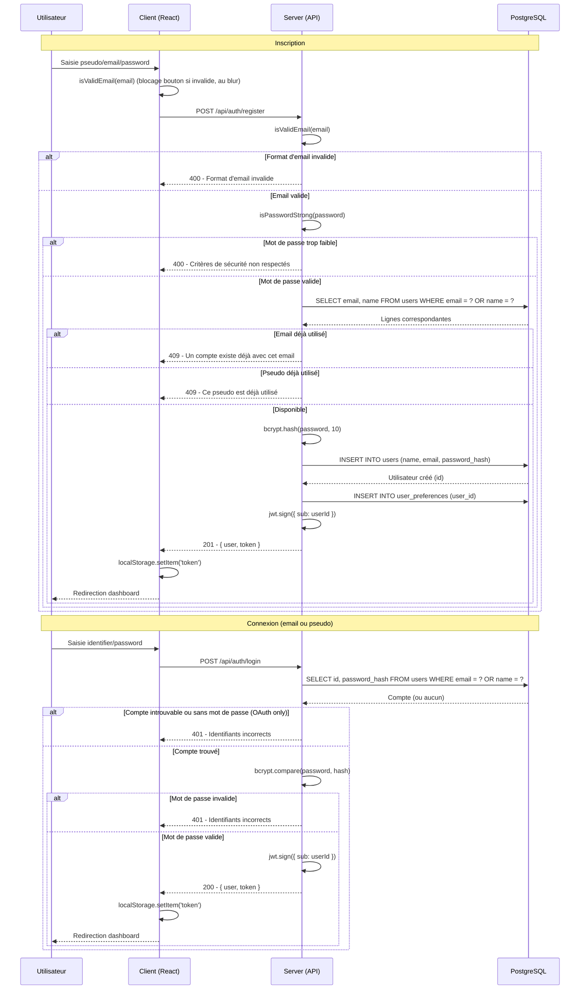
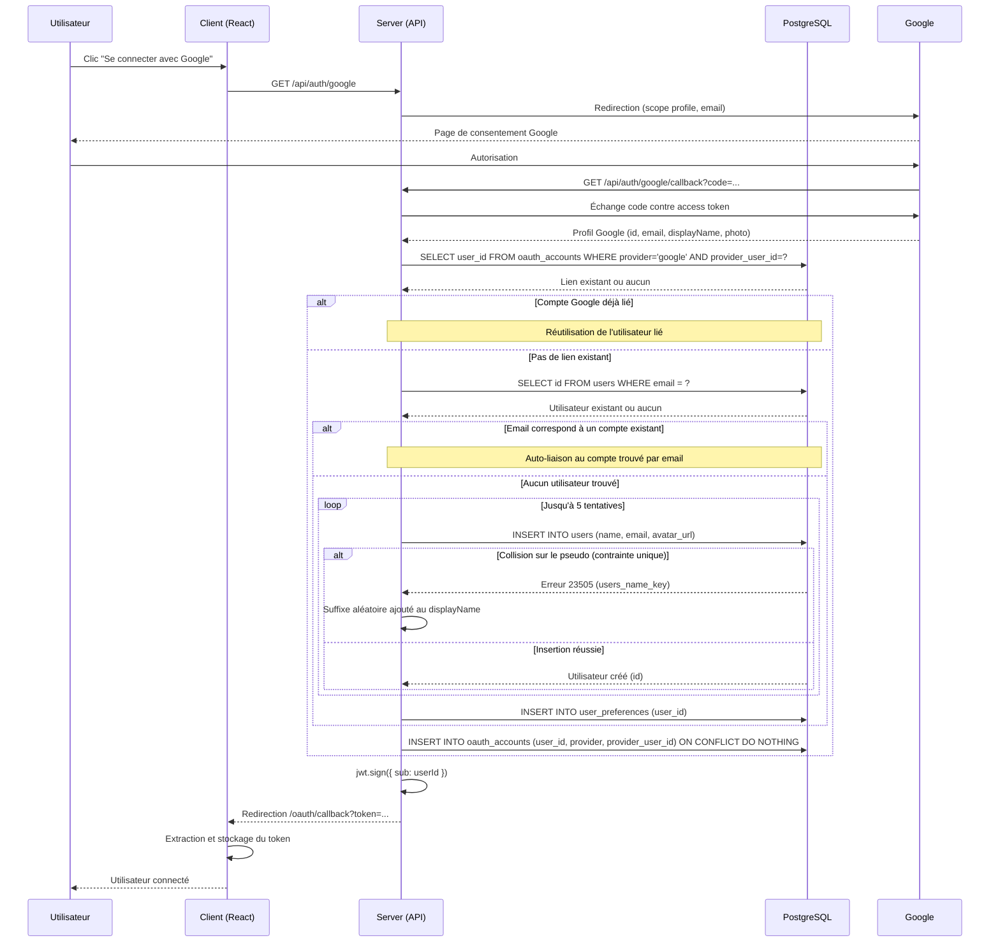

## Diagramme de séquence - Authentification classique

```mermaid
sequenceDiagram
    participant U as Utilisateur
    participant C as Client (React)
    participant S as Server (API)
    participant DB as PostgreSQL

    Note over U,DB: Inscription
    U->>C: Saisie pseudo/email/password
    C->>C: isValidEmail(email) (blocage bouton si invalide, au blur)
    C->>S: POST /api/auth/register
    S->>S: isValidEmail(email)
    alt Format d'email invalide
        S-->>C: 400 - Format d'email invalide
    else Email valide
        S->>S: isPasswordStrong(password)
        alt Mot de passe trop faible
            S-->>C: 400 - Critères de sécurité non respectés
        else Mot de passe valide
            S->>DB: SELECT email, name FROM users WHERE email = ? OR name = ?
            DB-->>S: Lignes correspondantes
            alt Email déjà utilisé
                S-->>C: 409 - Un compte existe déjà avec cet email
            else Pseudo déjà utilisé
                S-->>C: 409 - Ce pseudo est déjà utilisé
            else Disponible
                S->>S: bcrypt.hash(password, 10)
                S->>DB: INSERT INTO users (name, email, password_hash)
                DB-->>S: Utilisateur créé (id)
                S->>DB: INSERT INTO user_preferences (user_id)
                S->>S: jwt.sign({ sub: userId })
                S-->>C: 201 - { user, token }
                C->>C: localStorage.setItem('token')
                C-->>U: Redirection dashboard
            end
        end
    end

    Note over U,DB: Connexion (email ou pseudo)
    U->>C: Saisie identifier/password
    C->>S: POST /api/auth/login
    S->>DB: SELECT id, password_hash FROM users WHERE email = ? OR name = ?
    DB-->>S: Compte (ou aucun)
    alt Compte introuvable ou sans mot de passe (OAuth only)
        S-->>C: 401 - Identifiants incorrects
    else Compte trouvé
        S->>S: bcrypt.compare(password, hash)
        alt Mot de passe invalide
            S-->>C: 401 - Identifiants incorrects
        else Mot de passe valide
            S->>S: jwt.sign({ sub: userId })
            S-->>C: 200 - { user, token }
            C->>C: localStorage.setItem('token')
            C-->>U: Redirection dashboard
        end
    end
```

## Diagramme de séquence - Authentification Google OAuth

```mermaid
sequenceDiagram
    participant U as Utilisateur
    participant C as Client (React)
    participant S as Server (API)
    participant DB as PostgreSQL
    participant G as Google

    U->>C: Clic "Se connecter avec Google"
    C->>S: GET /api/auth/google
    S->>G: Redirection (scope profile, email)
    G-->>U: Page de consentement Google
    U->>G: Autorisation
    G->>S: GET /api/auth/google/callback?code=...
    S->>G: Échange code contre access token
    G-->>S: Profil Google (id, email, displayName, photo)

    S->>DB: SELECT user_id FROM oauth_accounts WHERE provider='google' AND provider_user_id=?
    DB-->>S: Lien existant ou aucun
    alt Compte Google déjà lié
        Note over S,DB: Réutilisation de l'utilisateur lié
    else Pas de lien existant
        S->>DB: SELECT id FROM users WHERE email = ?
        DB-->>S: Utilisateur existant ou aucun
        alt Email correspond à un compte existant
            Note over S,DB: Auto-liaison au compte trouvé par email
        else Aucun utilisateur trouvé
            loop Jusqu'à 5 tentatives
                S->>DB: INSERT INTO users (name, email, avatar_url)
                alt Collision sur le pseudo (contrainte unique)
                    DB-->>S: Erreur 23505 (users_name_key)
                    S->>S: Suffixe aléatoire ajouté au displayName
                else Insertion réussie
                    DB-->>S: Utilisateur créé (id)
                end
            end
            S->>DB: INSERT INTO user_preferences (user_id)
        end
        S->>DB: INSERT INTO oauth_accounts (user_id, provider, provider_user_id) ON CONFLICT DO NOTHING
    end

    S->>S: jwt.sign({ sub: userId })
    S-->>C: Redirection /oauth/callback?token=...
    C->>C: Extraction et stockage du token
    C-->>U: Utilisateur connecté
```
