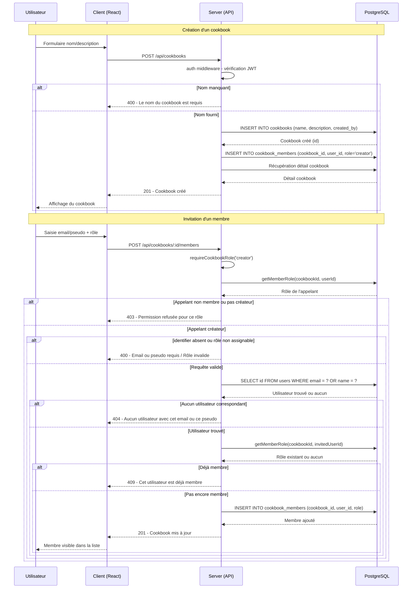
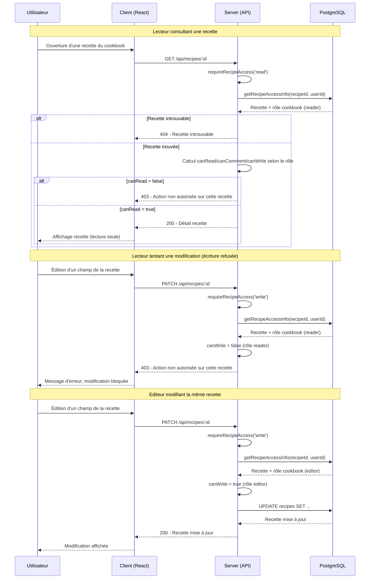

## Diagramme de séquence - Création de cookbook et invitation d'un membre

```mermaid
sequenceDiagram
    participant U as Utilisateur
    participant C as Client (React)
    participant S as Server (API)
    participant DB as PostgreSQL

    Note over U,DB: Création d'un cookbook
    U->>C: Formulaire nom/description
    C->>S: POST /api/cookbooks
    S->>S: auth middleware - vérification JWT
    alt Nom manquant
        S-->>C: 400 - Le nom du cookbook est requis
    else Nom fourni
        S->>DB: INSERT INTO cookbooks (name, description, created_by)
        DB-->>S: Cookbook créé (id)
        S->>DB: INSERT INTO cookbook_members (cookbook_id, user_id, role='creator')
        S->>DB: Récupération détail cookbook
        DB-->>S: Détail cookbook
        S-->>C: 201 - Cookbook créé
        C-->>U: Affichage du cookbook
    end

    Note over U,DB: Invitation d'un membre
    U->>C: Saisie email/pseudo + rôle
    C->>S: POST /api/cookbooks/:id/members
    S->>S: requireCookbookRole('creator')
    S->>DB: getMemberRole(cookbookId, userId)
    DB-->>S: Rôle de l'appelant
    alt Appelant non membre ou pas créateur
        S-->>C: 403 - Permission refusée pour ce rôle
    else Appelant créateur
        alt identifier absent ou rôle non assignable
            S-->>C: 400 - Email ou pseudo requis / Rôle invalide
        else Requête valide
            S->>DB: SELECT id FROM users WHERE email = ? OR name = ?
            DB-->>S: Utilisateur trouvé ou aucun
            alt Aucun utilisateur correspondant
                S-->>C: 404 - Aucun utilisateur avec cet email ou ce pseudo
            else Utilisateur trouvé
                S->>DB: getMemberRole(cookbookId, invitedUserId)
                DB-->>S: Rôle existant ou aucun
                alt Déjà membre
                    S-->>C: 409 - Cet utilisateur est déjà membre
                else Pas encore membre
                    S->>DB: INSERT INTO cookbook_members (cookbook_id, user_id, role)
                    DB-->>S: Membre ajouté
                    S-->>C: 201 - Cookbook mis à jour
                    C-->>U: Membre visible dans la liste
                end
            end
        end
    end
```

## Diagramme de séquence - Accès et permissions sur une recette d'un cookbook

```mermaid
sequenceDiagram
    participant U as Utilisateur
    participant C as Client (React)
    participant S as Server (API)
    participant DB as PostgreSQL

    Note over U,DB: Lecteur consultant une recette
    U->>C: Ouverture d'une recette du cookbook
    C->>S: GET /api/recipes/:id
    S->>S: requireRecipeAccess('read')
    S->>DB: getRecipeAccessInfo(recipeId, userId)
    DB-->>S: Recette + rôle cookbook (reader)
    alt Recette introuvable
        S-->>C: 404 - Recette introuvable
    else Recette trouvée
        S->>S: Calcul canRead/canComment/canWrite selon le rôle
        alt canRead = false
            S-->>C: 403 - Action non autorisée sur cette recette
        else canRead = true
            S-->>C: 200 - Détail recette
            C-->>U: Affichage recette (lecture seule)
        end
    end

    Note over U,DB: Lecteur tentant une modification (écriture refusée)
    U->>C: Édition d'un champ de la recette
    C->>S: PATCH /api/recipes/:id
    S->>S: requireRecipeAccess('write')
    S->>DB: getRecipeAccessInfo(recipeId, userId)
    DB-->>S: Recette + rôle cookbook (reader)
    S->>S: canWrite = false (rôle reader)
    S-->>C: 403 - Action non autorisée sur cette recette
    C-->>U: Message d'erreur, modification bloquée

    Note over U,DB: Editeur modifiant la même recette
    U->>C: Édition d'un champ de la recette
    C->>S: PATCH /api/recipes/:id
    S->>S: requireRecipeAccess('write')
    S->>DB: getRecipeAccessInfo(recipeId, userId)
    DB-->>S: Recette + rôle cookbook (editor)
    S->>S: canWrite = true (rôle editor)
    S->>DB: UPDATE recipes SET ...
    DB-->>S: Recette mise à jour
    S-->>C: 200 - Recette mise à jour
    C-->>U: Modification affichée
```
