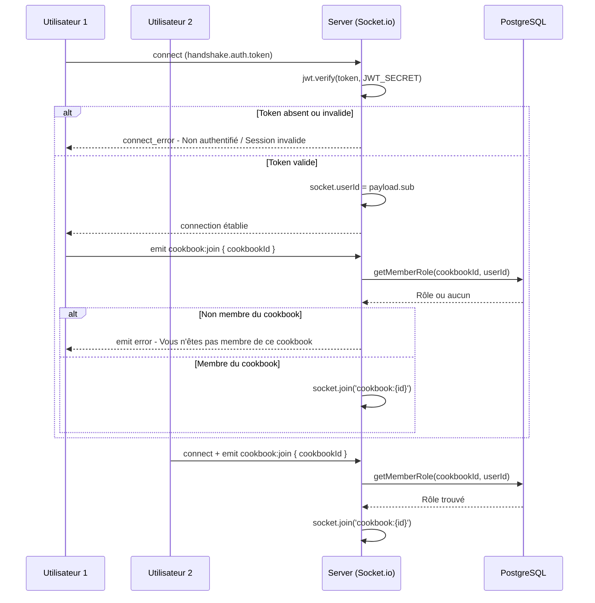
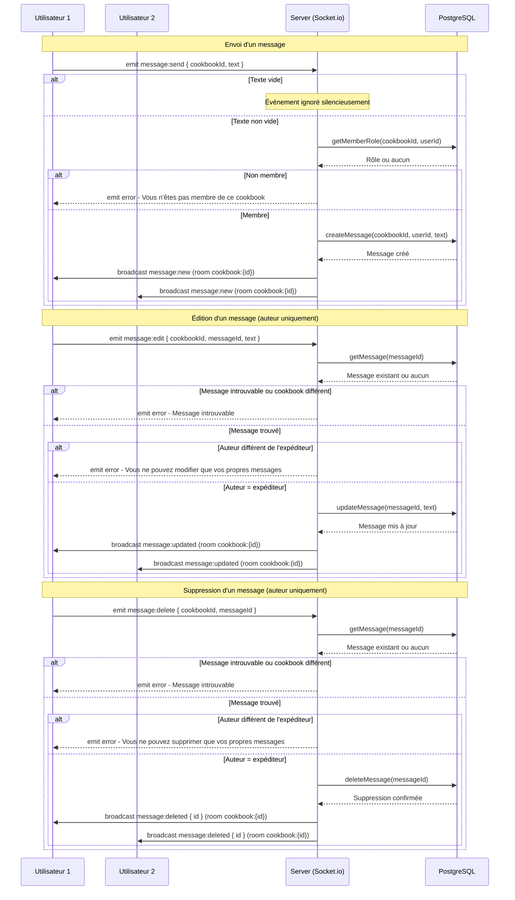

## Diagramme de séquence - Connexion et rejoindre la salle de discussion

```mermaid
sequenceDiagram
    participant U1 as Utilisateur 1
    participant U2 as Utilisateur 2
    participant S as Server (Socket.io)
    participant DB as PostgreSQL

    U1->>S: connect (handshake.auth.token)
    S->>S: jwt.verify(token, JWT_SECRET)
    alt Token absent ou invalide
        S-->>U1: connect_error - Non authentifié / Session invalide
    else Token valide
        S->>S: socket.userId = payload.sub
        S-->>U1: connection établie

        U1->>S: emit cookbook:join { cookbookId }
        S->>DB: getMemberRole(cookbookId, userId)
        DB-->>S: Rôle ou aucun
        alt Non membre du cookbook
            S-->>U1: emit error - Vous n'êtes pas membre de ce cookbook
        else Membre du cookbook
            S->>S: socket.join('cookbook:{id}')
        end
    end

    U2->>S: connect + emit cookbook:join { cookbookId }
    S->>DB: getMemberRole(cookbookId, userId)
    DB-->>S: Rôle trouvé
    S->>S: socket.join('cookbook:{id}')
```

## Diagramme de séquence - Envoi, édition et suppression d'un message

```mermaid
sequenceDiagram
    participant U1 as Utilisateur 1
    participant U2 as Utilisateur 2
    participant S as Server (Socket.io)
    participant DB as PostgreSQL

    Note over U1,DB: Envoi d'un message
    U1->>S: emit message:send { cookbookId, text }
    alt Texte vide
        Note over S: Événement ignoré silencieusement
    else Texte non vide
        S->>DB: getMemberRole(cookbookId, userId)
        DB-->>S: Rôle ou aucun
        alt Non membre
            S-->>U1: emit error - Vous n'êtes pas membre de ce cookbook
        else Membre
            S->>DB: createMessage(cookbookId, userId, text)
            DB-->>S: Message créé
            S->>U1: broadcast message:new (room cookbook:{id})
            S->>U2: broadcast message:new (room cookbook:{id})
        end
    end

    Note over U1,DB: Édition d'un message (auteur uniquement)
    U1->>S: emit message:edit { cookbookId, messageId, text }
    S->>DB: getMessage(messageId)
    DB-->>S: Message existant ou aucun
    alt Message introuvable ou cookbook différent
        S-->>U1: emit error - Message introuvable
    else Message trouvé
        alt Auteur différent de l'expéditeur
            S-->>U1: emit error - Vous ne pouvez modifier que vos propres messages
        else Auteur = expéditeur
            S->>DB: updateMessage(messageId, text)
            DB-->>S: Message mis à jour
            S->>U1: broadcast message:updated (room cookbook:{id})
            S->>U2: broadcast message:updated (room cookbook:{id})
        end
    end

    Note over U1,DB: Suppression d'un message (auteur uniquement)
    U1->>S: emit message:delete { cookbookId, messageId }
    S->>DB: getMessage(messageId)
    DB-->>S: Message existant ou aucun
    alt Message introuvable ou cookbook différent
        S-->>U1: emit error - Message introuvable
    else Message trouvé
        alt Auteur différent de l'expéditeur
            S-->>U1: emit error - Vous ne pouvez supprimer que vos propres messages
        else Auteur = expéditeur
            S->>DB: deleteMessage(messageId)
            DB-->>S: Suppression confirmée
            S->>U1: broadcast message:deleted { id } (room cookbook:{id})
            S->>U2: broadcast message:deleted { id } (room cookbook:{id})
        end
    end
```
