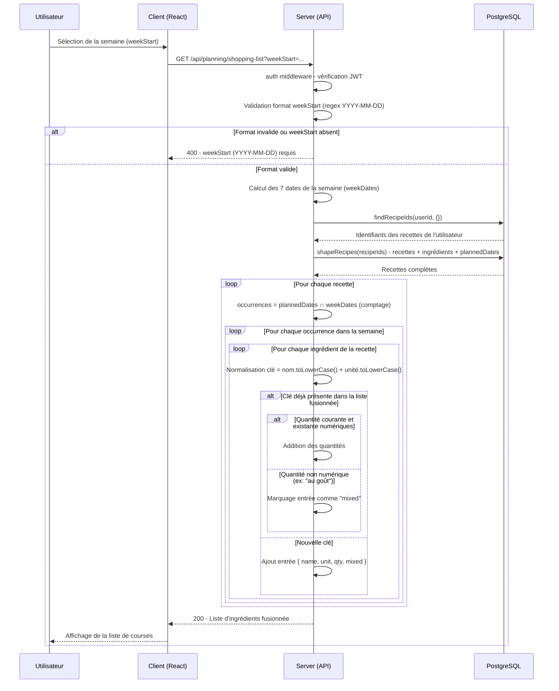

## Diagramme de séquence - Génération de la liste de courses

```mermaid
sequenceDiagram
    participant U as Utilisateur
    participant C as Client (React)
    participant S as Server (API)
    participant DB as PostgreSQL

    U->>C: Sélection de la semaine (weekStart)
    C->>S: GET /api/planning/shopping-list?weekStart=...
    S->>S: auth middleware - vérification JWT
    S->>S: Validation format weekStart (regex YYYY-MM-DD)

    alt Format invalide ou weekStart absent
        S-->>C: 400 - weekStart (YYYY-MM-DD) requis
    else Format valide
        S->>S: Calcul des 7 dates de la semaine (weekDates)
        S->>DB: findRecipeIds(userId, {})
        DB-->>S: Identifiants des recettes de l'utilisateur
        S->>DB: shapeRecipes(recipeIds) - recettes + ingrédients + plannedDates
        DB-->>S: Recettes complètes

        loop Pour chaque recette
            S->>S: occurrences = plannedDates ∩ weekDates (comptage)
            loop Pour chaque occurrence dans la semaine
                loop Pour chaque ingrédient de la recette
                    S->>S: Normalisation clé = nom.toLowerCase() + unité.toLowerCase()
                    alt Clé déjà présente dans la liste fusionnée
                        alt Quantité courante et existante numériques
                            S->>S: Addition des quantités
                        else Quantité non numérique (ex: "au goût")
                            S->>S: Marquage entrée comme "mixed"
                        end
                    else Nouvelle clé
                        S->>S: Ajout entrée { name, unit, qty, mixed }
                    end
                end
            end
        end

        S-->>C: 200 - Liste d'ingrédients fusionnée
        C-->>U: Affichage de la liste de courses
    end
```
