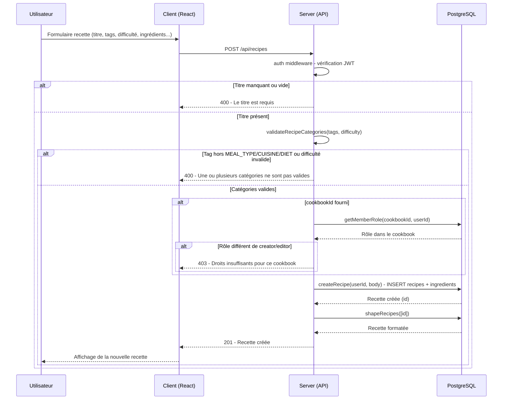
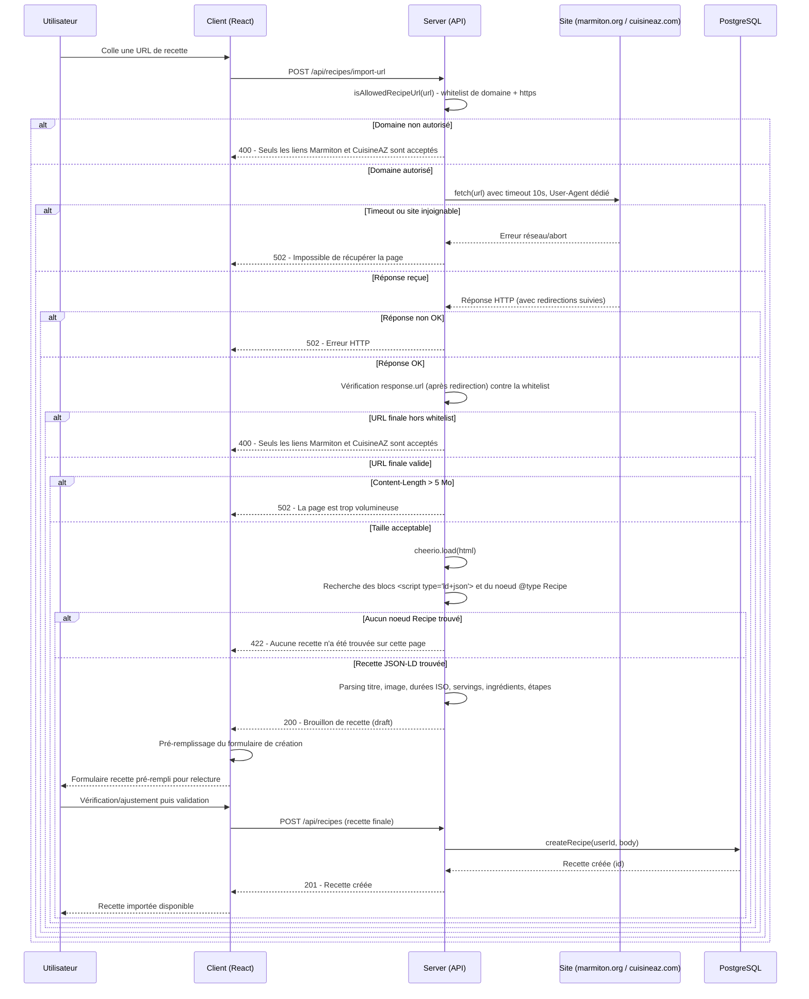

## Diagramme de séquence - Création manuelle d'une recette

```mermaid
sequenceDiagram
    participant U as Utilisateur
    participant C as Client (React)
    participant S as Server (API)
    participant DB as PostgreSQL

    U->>C: Formulaire recette (titre, tags, difficulté, ingrédients...)
    C->>S: POST /api/recipes
    S->>S: auth middleware - vérification JWT
    alt Titre manquant ou vide
        S-->>C: 400 - Le titre est requis
    else Titre présent
        S->>S: validateRecipeCategories(tags, difficulty)
        alt Tag hors MEAL_TYPE/CUISINE/DIET ou difficulté invalide
            S-->>C: 400 - Une ou plusieurs catégories ne sont pas valides
        else Catégories valides
            alt cookbookId fourni
                S->>DB: getMemberRole(cookbookId, userId)
                DB-->>S: Rôle dans le cookbook
                alt Rôle différent de creator/editor
                    S-->>C: 403 - Droits insuffisants pour ce cookbook
                end
            end
            S->>DB: createRecipe(userId, body) - INSERT recipes + ingredients
            DB-->>S: Recette créée (id)
            S->>DB: shapeRecipes([id])
            DB-->>S: Recette formatée
            S-->>C: 201 - Recette créée
            C-->>U: Affichage de la nouvelle recette
        end
    end
```

## Diagramme de séquence - Import de recette depuis une URL

```mermaid
sequenceDiagram
    participant U as Utilisateur
    participant C as Client (React)
    participant S as Server (API)
    participant Site as Site (marmiton.org / cuisineaz.com)
    participant DB as PostgreSQL

    U->>C: Colle une URL de recette
    C->>S: POST /api/recipes/import-url
    S->>S: isAllowedRecipeUrl(url) - whitelist de domaine + https

    alt Domaine non autorisé
        S-->>C: 400 - Seuls les liens Marmiton et CuisineAZ sont acceptés
    else Domaine autorisé
        S->>Site: fetch(url) avec timeout 10s, User-Agent dédié
        alt Timeout ou site injoignable
            Site-->>S: Erreur réseau/abort
            S-->>C: 502 - Impossible de récupérer la page
        else Réponse reçue
            Site-->>S: Réponse HTTP (avec redirections suivies)
            alt Réponse non OK
                S-->>C: 502 - Erreur HTTP
            else Réponse OK
                S->>S: Vérification response.url (après redirection) contre la whitelist
                alt URL finale hors whitelist
                    S-->>C: 400 - Seuls les liens Marmiton et CuisineAZ sont acceptés
                else URL finale valide
                    alt Content-Length > 5 Mo
                        S-->>C: 502 - La page est trop volumineuse
                    else Taille acceptable
                        S->>S: cheerio.load(html)
                        S->>S: Recherche des blocs <script type="ld+json"> et du noeud @type Recipe
                        alt Aucun noeud Recipe trouvé
                            S-->>C: 422 - Aucune recette n'a été trouvée sur cette page
                        else Recette JSON-LD trouvée
                            S->>S: Parsing titre, image, durées ISO, servings, ingrédients, étapes
                            S-->>C: 200 - Brouillon de recette (draft)
                            C->>C: Pré-remplissage du formulaire de création
                            C-->>U: Formulaire recette pré-rempli pour relecture
                            U->>C: Vérification/ajustement puis validation
                            C->>S: POST /api/recipes (recette finale)
                            S->>DB: createRecipe(userId, body)
                            DB-->>S: Recette créée (id)
                            S-->>C: 201 - Recette créée
                            C-->>U: Recette importée disponible
                        end
                    end
                end
            end
        end
    end
```
